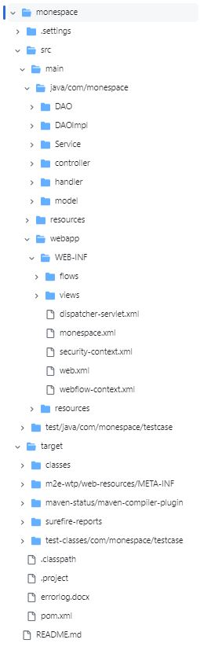
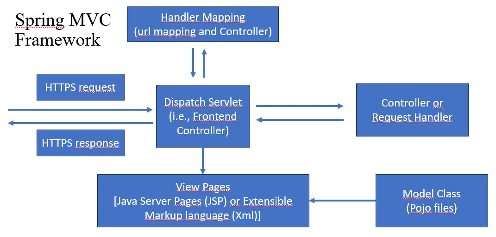

<h1>monespace!</h1>
<h2>E-Commerce Web Application developed using Spring Eclipse Enterprise application tools and JAVA programming</h2>

 The E-Commerce web application is developed with a theme of Real estate website to list the real estate either to rent or sell

A Web application that will allow users with different user roles for instance, 
User - who is willing to rent or buy property and can visit the website by completing a registration process (Web-flow).
Dealer - who wants to add property either for renting or selling
Admin - who can monitor the changes made by Dealer into the database and can authorize the changes made. Also) to Buy, Sell or Rent Properties available on website. 

The Spring MVC Frmae work mainly includes following list of elements with their function in brief:

<ol>
  <li>Dispatch Servlet also called a Front-End Controller: It handles the HTTPS request received from users for which it gives the HTTPS response after completing user-specified operations in the back-end through series of operations</li>
  <li>Main Controller or Request Handler: </li>
  <li>Handler Mapping or URL mapping </li>
  <li>View Pages: Includes different View Pages that end-user can see or send a request to see</li>
  <li>Model class: Also called "Pojo files" which are the schema or skeleton of different objects that can be added into the database i.e., details of properties/real estate, user roles, user details which they provide during registration, user transactions, etc. in case of this web application</li>
</ol>

<h2>Web-Flow process</h2>

The web flow process is provided for:

<ol>
<li>User or Dealer Registration to the website</li>
<li>To complete the Transaction of buying or renting one or more properties made available on the website</li>
</ol>
